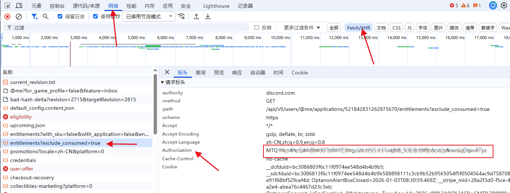

# FreezeHost 自动续期 & 重启

> ⭐ 觉得有用？给个 Star 支持一下！
>
> 注册地址：[https://free.freezehost.pro](https://free.freezehost.pro)

用于 [FreezeHost](https://free.freezehost.pro) 免费服务器的自动续期与重启管理，基于 GitHub Actions，使用 Playwright 模拟浏览器操作，最多支持 5 个 Discord 账号。

## 包含的 Workflow

| Workflow 名称 | 功能 | 触发方式 |
|---|---|---|
| `FreezeHost 续期多账号版` | 自动续期服务器，到期前 2 天运行，自动更新 Cron | 定时 + 手动 |
| `FreezeHost 自动重启` | 重启/开机服务器，支持指定 Discord 账号 | 手动 + API |

## 功能

### 续期
- 自动 Discord OAuth 登录并续期名下所有服务器
- 最多支持 5 个 Discord Token，各自拥有独立 Cron 计划
- 站点宕机自动重试（最多 3 次）
- 续期后计算下次运行时间（到期前 2 天），自动更新 Workflow 中的 Cron 表达式
- **sing-box 代理**（复用 katabump 同款方案）绕过 FreezeHost 数据中心 IP 拉黑
- Telegram 通知推送续期结果（含合并截图）

### 重启
- 自动检测服务器电源状态（运行/关机/过渡状态）
- 运行中 → 执行重启；关机 → 执行开机；过渡 → 等待稳定后操作
- 重启/开机结果 Telegram 通知（含截图）

## 配置 Secrets

在仓库 `Settings → Secrets and variables → Actions` 中添加：

| Secret 名称 | 必填 | 说明 |
|---|---|---|
| `FREEZEHOST_DISCORD_TOKEN_1` | ✅ | 第 1 个 Discord 账号 Token |
| `FREEZEHOST_DISCORD_TOKEN_2` | ❌ | 第 2 个 Discord 账号 Token（可选） |
| `FREEZEHOST_DISCORD_TOKEN_3` | ❌ | 第 3 个 Discord 账号 Token（可选） |
| `FREEZEHOST_DISCORD_TOKEN_4` | ❌ | 第 4 个 Discord 账号 Token（可选） |
| `FREEZEHOST_DISCORD_TOKEN_5` | ❌ | 第 5 个 Discord 账号 Token（可选） |
| `PROXY_URL` | ✅ | sing-box 节点链接 (vless/vmess/trojan/tuic/anytls/hysteria2/socks5)，**FreezeHost 会拉黑 GitHub Actions 原生 IP，必须配代理** |
| `REPO_TOKEN` | ✅ （仅续期） | 具有 `repo` 和 `workflow` 权限的 PAT，用于自动更新 Cron |
| `TG_BOT_TOKEN` | ❌ | Telegram Bot Token，用于推送通知 |
| `TG_CHAT_ID` | ❌ | Telegram 接收消息的 Chat ID |

### 关于 PROXY_URL（重要）

FreezeHost 会检测数据中心 IP（包括 GitHub Actions 的 Azure 段、Cloudflare WARP）并返回：
```
we have detected that you are using a proxy to access our hosting service
which is against our TOS and thus you have been blocked from using our hosting
```

因此必须配置一个**住宅 IP / 真实 VPS** 的代理节点。本仓库复用 katabump 的 sing-box 方案，支持以下协议：
- `vless://` / `vmess://` / `trojan://`
- `tuic://` / `hysteria2://` / `hy2://`
- `anytls://` / `socks5://` / `socks://`

如果你已经在 katabump 仓库配过 `PROXY_URL`，直接复用同一个节点即可。

### 获取 Discord Token

1. 在浏览器中登录 [Discord](https://discord.com)
2. 按 `F12` 打开开发者工具 → `Network`（网络）
3. 筛选 `Fetch/XHR`，刷新页面
4. 点击任意 `discord.com/api` 请求
5. 在 `Headers`（请求头）中找到 `Authorization` 并复制完整值
6. 填入对应 `FREEZEHOST_DISCORD_TOKEN_*`
> 📌 图片参考：

⚠️ 注意：该值相当于账号凭证，请勿泄露

### 获取 REPO_TOKEN（仅续期需要）

1. 打开 [GitHub Tokens](https://github.com/settings/tokens) → Generate new token (classic)
2. 勾选 `repo`（全部）与 `workflow`
3. 生成后复制并填入 Secret

### Telegram 通知（可选）

1. [@BotFather](https://t.me/BotFather) 创建 Bot 获得 `TG_BOT_TOKEN`
2. 向 Bot 发送任意消息，访问 `https://api.telegram.org/bot<TOKEN>/getUpdates` 获取 `chat.id` 作为 `TG_CHAT_ID`

## 使用方法

### 1. Fork 并启用 Actions
- Fork 本仓库
- 在仓库 Actions 页面启用 workflows（若未自动启用）

### 2. 配置 Secrets
- 按上方表格添加 Secrets，至少配置 `FREEZEHOST_DISCORD_TOKEN_1`

### 3. 选择触发方式

#### 自动续期（定时）
- 默认已配置 5 条独立 Cron 规则，分别对应 5 个 Token（UTC 01~05 每个整点错开）
- 首次运行后，Workflow 会根据剩余天数自动更新对应 Cron，之后将在到期前 2 天准时运行

#### 手动触发
- **续期**：Actions → `FreezeHost 续期多账号版` → `Run workflow`，选择 Token 编号
- **重启**：Actions → `FreezeHost 自动重启` → `Run workflow`，选择 Token 编号

#### API 触发（仅重启）
可通过 `curl` 或任何 HTTP 客户端调用 GitHub REST API 手动触发重启 Workflow。

```bash
curl -X POST "https://api.github.com/repos/<用户名>/<仓库名>/actions/workflows/FreezeHost_Restart.yml/dispatches" \
  -H "Accept: application/vnd.github+json" \
  -H "Authorization: Bearer <你的 PAT 或 GITHUB_TOKEN>" \
  -d '{"ref":"main","inputs":{"token_number":"2"}}'
```

> 注意：
> - 替换 `<用户名>`、`<仓库名>` 以及 Token
> - `token_number` 可选 `1`~`5`，对应已配置的 Secret
> - 使用具有 `workflow` 权限的 Token（如 `REPO_TOKEN` 或 Fine-grained PAT）
> - 文件名请与 `.github/workflows/` 下实际文件名一致

## 工作原理（续期）

1. 根据 Cron 或手动选择确定要使用的 Token 编号
2. 拉取仓库、安装 Playwright，通过 `setup_proxy.sh` 启动 sing-box 代理
3. Python 脚本通过代理启动 Chromium，模拟浏览器登录 FreezeHost（Discord OAuth）
4. 扫描 Dashboard 下所有服务器，逐一检查剩余时间并执行续期
5. 提取最小剩余天数，计算下次运行时间（到期前 2 天）
6. 使用 `REPO_TOKEN` 自动更新对应 Cron 行并提交
7. 通过 Telegram 发送结果截图

## 工作原理（重启）

1. 手动或 API 触发时指定 Token 编号
2. 拉取仓库、安装 Playwright，通过 sing-box 代理出口
3. 脚本登录 FreezeHost，发现所有服务器
4. 检测每台服务器电源状态：
   - 运行中 → 执行重启
   - 关机 → 执行开机
   - 过渡中 → 等待稳定后按上述规则处理
5. 将操作结果通过 Telegram 推送（含截图）

## 注意事项

- 至少配置 `FREEZEHOST_DISCORD_TOKEN_1` 才能使用
- 续期需要 `REPO_TOKEN` 拥有 `workflow` 权限，否则无法自动调整 Cron
- 重启 Workflow 没有定时计划，仅限手动或 API 触发
- 某 Token 下若无服务器，会收到“无服务器”通知并跳过
- 站点宕机时续期脚本会自动重试 3 次，若持续失败将推送通知
- 敏感信息（Token、邮箱、服务器 ID）在日志与截图中已脱敏

---

**⚠️ 免责声明**：本脚本仅供学习交流使用，使用者需遵守 [FreezeHost](https://free.freezehost.pro) 的服务条款。因使用本脚本造成的任何问题，作者不承担任何责任。
